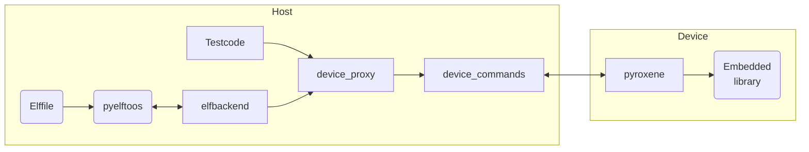

[](https://github.com/hackenbergstefan/pyroxene/actions/workflows/lint.yml)
[](https://github.com/hackenbergstefan/pyroxene/actions/workflows/test.yml)

# Pyroxene

## Introduction

Testing libraries on embedded devices requires always "some code around" to establish a communication between host and embedded device.
This ist often called "MiniOS" or "TestOS".
Usually every team of develops such a small operating system independently.

In the end you have a bunch of embedded applications with only one purpose:
Functional verification of a library.

What would happens if we could unify all these approaches?
Thinking about what is needed for such a unified test application we realize that we need only 3 "commands" the embedded device must support:

1. Read data from memory locations.
2. Write data to memory locations.
3. Call functions with parameters and return the result.

Everything else can be done on a host system!

## Overview and example



### Example

Let's consider the following example:
A C library (for embedded devices) implements the following function:

```C
unsigned int addition(unsigned int arg1, unsigned int arg2)
{
    return arg1 + arg2;
}
```

A tester familiar with Python unittest wants to write the following test code:

```python
class TestLibrary(unittest.TestCase):
    def test_addition(self)
        response = lib.addition(39, 3)
        self.assertEqual(response, 42)
```

Pyroxene makes this possible!

- `lib` is a [pyroxene.device_proxy.LibProxy](./pyroxene/device_proxy) object.
- `LibProxy` "knows" everything about the library by examining the elf-binary.
  So it is able to resolve the address of the exported function `addition`.
  (`lib.addition` is an object of type `pyroxene.device_proxy.FuncProxy`)
- Calling that function instructs the `FuncProxy` to convert all arguments to a list of integers (see #Scope).
- These list is marshaled in `device_commands` and sent to the (embedded) target device.
- The answer get's un-marshaled and returned to the caller.

## Scope

- Pyroxene focuses on libraries written in C.
- Pyroxene needs debug information in the compiled elf-file.
- Pyroxene supports reading macros currently only using `fromelf`.
- Pyroxene makes assumptions about the calling convention of the target architecture:
  All arguments which are passed to functions must be compatible to `unsigned long`.
  E.g. A `uint8_t`-value must be passed same as it would be a `uint32_t`.
  For ARM Thumb-2 and x86_64 this holds true.
  In a nutshell: _Everything is `ulong`!_

## Pyroxene Commands

There are three device commands:

- `memory_read`: </br>
  `0x01 [uint16] | cmdlen [uint16] | addr [ulong] | length [ulong]` </br>
  Returns: `response [length]`
- `memory_write`: </br>
  `0x02 [uint16] | cmdlen [uint16] | addr [ulong] | data [datalength]` </br>
  Returns: Nothing.
- `call`: </br>
  `0x03 [uint16] | cmdlen [uint16] | addr [ulong] | retlength [ulong] | number_of_args [ulong] | arg1 [ulong] | ... | argn[ulong]` </br>
  Returns: `response [retlength]`.

## Limitations (as of now)

- Pyroxene does not support floating point data types.
- Pyroxene does not support target architectures where the size of the address space does not equal the size of `unsigned long`.
- Pyroxene does not implement error handling on protocol level.
